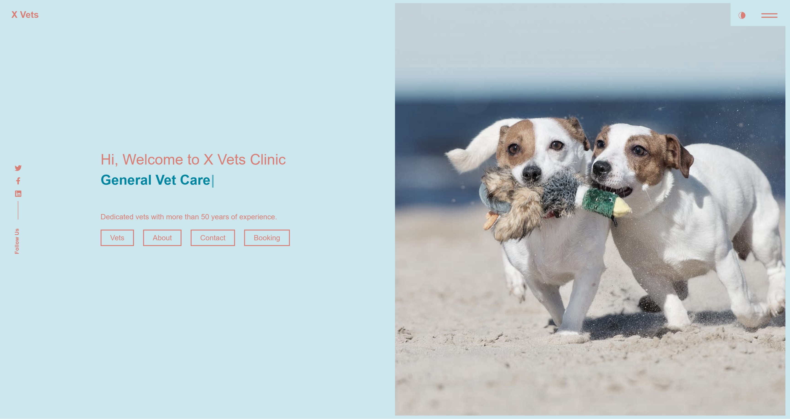

# A Vet Site


## Description

<p>In the final bootcamp project I decided to build a website for a vet clinic, which includes an interactive booking system.</p>
<p>The idea came to mind when my girlfriend, who's a vet, vent her frustrations one day when her schedule was very disorganised.</p>
<p>Therefore, I want to build a new website for her clinic, based on modern web framework and technologies.

* <b>Designer</b> Jesse Chen

Along the way I have encountered a few challenges in achieving my goals. Some of the challenges are as follows:

* No prior knowledge of REACT framework and GraphQL data query language.
* There is a substantial amount of documentation to refer when working with 3rd party packages like MongoDB, Apollo server and Vite.
* I have encountered a few issues because of typos in GraphQL schemas, which are not highlighted in VS Code.
* I had some difficulties in deploying the application on Heroku.

## Table of Contents

- [Description](#description)
- [About Us](#about-us)
- [Key Features](#key-features)
    - [Information about the clinic's expertise and animal treatments](#1-useful-information)
    - [User Booking](#2-user-booking)
    - [Daily Scheduler](#3-daily-scheduler) 
    - [Upcoming Releases](#4-upcoming-releases)
- [Technologies Used](#technologies-used)
- [Installation](#installation)
- [Usage](#usage)
- [Credits](#credits)
- [License](#license)
- [Contribution Guidelines](#contribution-guidelines)
- [Links](#links)

## About Us

Our platform is dedicated to providing an informative, interactive and user-friendly web site for clients who are eager to seek advice and/or treatment for their beloved pets.

## Key Features

### 1. Information about the clinic's expertise and animal treatments

The website provides comprehensive and up-to-date information about staffs' expertise and general advise on animal treatment.

### 2. User Booking

Create your account and book your appointment! You can edit or delete any existing booking while you have the visibility of all your booking history.

### 3. Daily Scheduler

For 'Admin' login managed by the clinic, the web site provide visibility of today's schedule, so that busy vets can prepare and plan their activities.

### 4. Upcoming Releases

Want to see comprehensive statistics on patients' symptoms? Keep an eye on the next release. 

## Technologies Used
- Dependencies: apollo/server (v4.7.1), graphql (v16.6.0), express (v4.17.2), dotenv (v8.6.0), bcrypt (v4.0.1), jsonwebtoken (v8.5.1), mongoose (v7.0.2), apollo/client (v3.7.14), bootstrap (v5.2.3), react (v18.2.0), typewriter-effect (v2.18.2), vite (v4.4.11), date-fns (v2.30.0), MUI react components
- Testing: Apollo server

## Installation

1. Clone the repository: `git clone git@github.com:JesseCh3n/a-vet-site.git`
2. Open in VS Code. If not installed, [install VS Code](https://code.visualstudio.com/).
3. Install Node.js v16 (e.g., using npm: `npm i node@16`).
4. Install dependencies packages: `npm i`
5. Seed 'User' data: `npm run seed`
6. Create a `.env` file in the project root directory to store your environment variables. This file should contain sensitive information like database credentials and API keys. Here's an example .env file:
    
    ```
    # .env
    JWT_SECRET = ''
    ```
7. Start application: `npm run develop`

## Usage

You can start interacting with the vet clinic web site via this [link](https://agile-chamber-51883-7e60747c00dc.herokuapp.com/).

The following credentials can be used for testing purpose:
- Admin user email: admin@xvets123.com; password: xvets123
- A fake user email: wtls@techfriends.dev; password: password03 

## Credits

Credit to examples provided by Coding Bootcamp. React templates are based on this [source code](https://github.com/ubaimutl/react-portfolio)

## License
- [MIT](https://opensource.org/licenses/MIT)
- `Copyright © 2023 Jesse Chen`

## Contribution Guidelines
```
1. Familiarize yourself with MIT license terms
2. Clone the project's repository to your local machine.
3. Create a seperate branch of your work.
4. Develop well-structured and well-documented code.
5. Run tests to ensure your changes work.
6. License your contributions under the terms of the MIT License.
7. Be respectful and collaborative in discussions.
```

## Links 

[Github Repository](https://github.com/JesseCh3n/a-vet-site) 

[Heroku application](https://agile-chamber-51883-7e60747c00dc.herokuapp.com/)